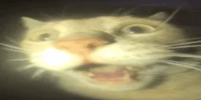

<h1 align="center">PyGameTest (VGame)</h1>

<p align="center"><a href="https://github.com/psf/black"></a>


<p align="center">My try to build game engine on top of PyGame

This thing replicates [Love2D](https://love2d.org)-like [interface](#how-to-use)
<br>
<br>


<br>_funny silly cat (almost as this project😁)_


## How to install

```shell
git clone https://github.com/virashu/pygametest
cd pygametest

python3 -m venv .env

pip install .
```

## How to use

Examples directory contains basic implementation.

Structure looks like this:

```python
from vgame import Game, Run

class MyGame(Game):
  def load(self):
    # actions before game loads

  def update(self):
    # update loop
    # + delta time

  def draw(self):
    # draw loop
    # + graphics object

  def exit(self):
    # actions before exit


Run(
  MyGame(width=800, height=600, framerate=120, tickrate=120, title="Game")
)

```

## TODO

- [x] Readme
- [x] Basic structure
- [ ] Graphics
  - [x] Texture library
- [ ] Backend
  - [x] Draw/update loops in separate threads
  - [x] Snapshots
  - [x] Snapshot synchronization
  - [x] PyGame sprite integration
  - [ ] Axis
  - [ ] Sounds
  - [ ] Event handling
  - [ ] quit method
